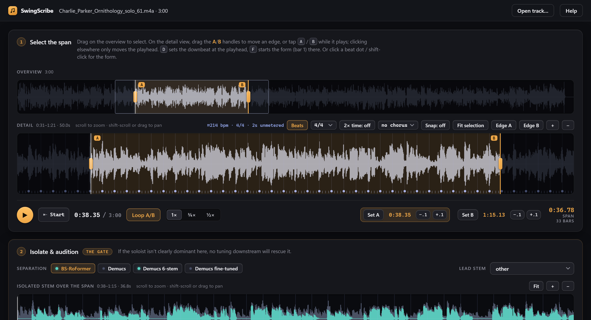
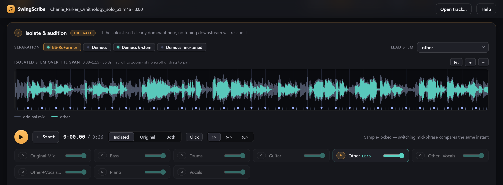
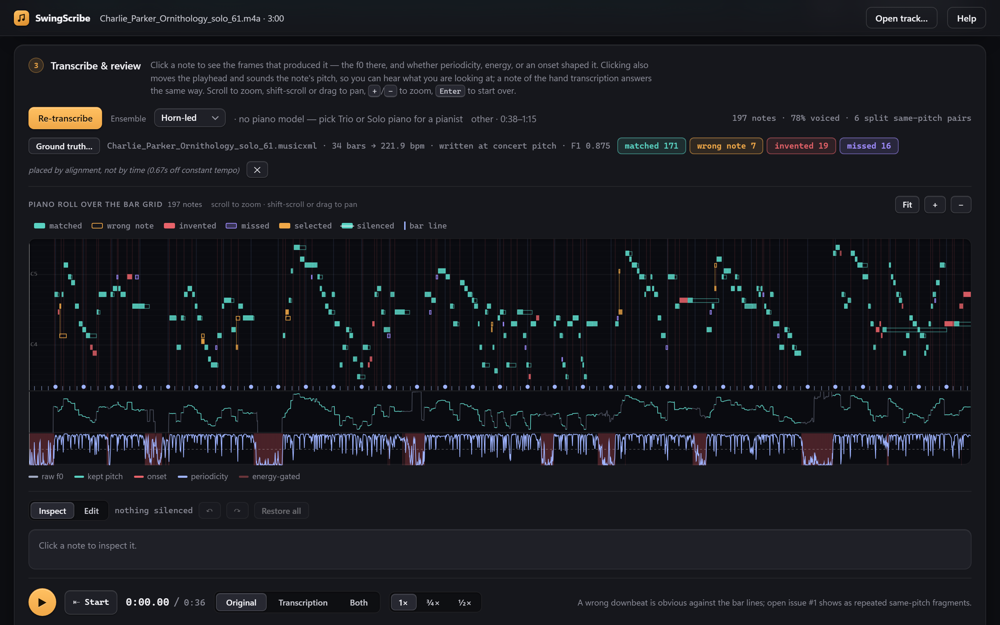

<h1 align="center">SwingScribe</h1>

<p align="center"><strong>A jazz recording in. A solo transcription out — with the swing written the way a player reads it.</strong></p>

<p align="center">
  <a href="src/swingscribe/gui/guide/user-guide.md">User guide</a> ·
  <a href="#get-started">Get started</a> ·
  <a href="#how-well-does-it-work">How well it works</a> ·
  <a href="docs/development.md">Developing</a>
</p>



SwingScribe listens to a record, pulls the soloist out of the band, works
out where the beats and bars fall, and writes the solo down as MusicXML you
can open in MuseScore. It knows that a swung eighth-note pair is written as
two eighths under a *Swing* marking, not as a triplet figure, and it keeps
the player's actual timing as data instead of throwing it away. Everything
runs on your own machine. Nothing is uploaded anywhere.

## Find the solo

Open a track and the whole recording is in front of you. Drag out the solo
on the overview, then place the edges precisely on the detail view: tap
<kbd>A</kbd> and <kbd>B</kbd> while it plays, nudge by a tenth of a second,
or snap to the nearest beat or bar. Loop it, slow it to any speed down to
a fifth without changing the pitch, and listen until the boundaries are
right.

The bar grid is drawn over the waveform before you transcribe anything —
a tick per beat, a numbered dot per bar, a gold mark at every chorus — so a
grid that does not match the tune is caught by eye, and by ear with the
built-in click track. Move the downbeat with one keypress. Tell it where
the form starts so an intro is not counted. Your choices are saved beside
the audio and are there when you come back.

## Isolate the soloist



State-of-the-art source separation splits the recording into stems, and
you hear the result before spending a minute on anything else. Switch
between the isolated instrument and the original mid-phrase — playback is
sample-locked, so you are comparing the same instant — and mix every stem
on its own fader to check what the model took and what it left behind.

Separation is scoped to the span you selected, so the best model,
BS-RoFormer, takes minutes rather than tens of minutes on an ordinary CPU.
Demucs is a click away when speed matters more. Every result is cached:
the same span never costs twice.

## Transcribe, review, export



The transcription lands on a piano roll over the same bar grid, with the
evidence that produced every note in the lanes beneath it. Click a note to
hear its pitch, see the frames behind it, and read why the transcriber made
the call it did. Play the original, the transcription rendered as tones, or
both together, at any speed.

Then fix what needs fixing. Silence a note that was heard right but belongs
to another instrument, drag a box to silence a run, and undo any of it.
Your edits are remembered by content, not by position, so they survive a
re-transcription. For a piano solo the polyphonic piano model gives a
second opinion: it corrects octaves, drops notes it cannot vouch for, fills
gaps in the line, and offers every note it heard that the line left out —
switch one on and it is written as a chord.

Export writes MusicXML beside the audio, transposed for the instrument you
choose, with the key signature moved to match, bars numbered from the start
of the solo the way a transcription is.

## Measure it against a human

Load a hand transcription and SwingScribe aligns it to its own, colours
every note — matched, wrong pitch, missed, invented — and reports the
score. It asks two questions separately, because they have different
answers: did we hear the right notes, and did we *write* them the way a
transcriber would?

## How well does it work

Measured against the Weimar Jazz Database's human-annotated solos, where
every note has a time and a pitch:

| measure | result |
|---|---|
| Note F1 (did we hear what was played) | 0.855, mean over 73 solos |
| Beat F1 (is the grid right) | 0.941, over the same 73 |

Those numbers come from a single command that scores every solo on disk,
and the project keeps a running list of what is still wrong in
[docs/benchmark-deficiencies.md](docs/benchmark-deficiencies.md). This is
research-grade software that is used daily; it is not finished, and it says
so.

## Get started

You need [uv](https://docs.astral.sh/uv/), Python 3.11, and ffmpeg for
anything other than wav or flac.

```
git clone https://github.com/elkayem/swingscribe.git
cd swingscribe
uv sync --group ml --group gui --group roformer
uv run python -m swingscribe gui
```

The app opens in your browser at `127.0.0.1:8420`. Name a file to open it
straight away:

```
uv run python -m swingscribe gui path/to/track.m4a
```

Model weights (about 300 MB) download on first use. A GPU is not required;
everything here was built and measured on a laptop without one.

The **[user guide](src/swingscribe/gui/guide/user-guide.md)** — also behind
the Help button in the app — covers every control, the keyboard shortcuts,
the command line, and troubleshooting. [docs/development.md](docs/development.md)
is for running the tests and the benchmarks.

## Under the hood

- **Separation:** BS-RoFormer, with Hybrid Transformer Demucs as the fast
  alternative.
- **Beats:** beat_this, tracked on the full mix and repaired into a bar grid
  you can steer.
- **Pitch:** CREPE, with hand-rolled onset detection and a line-selection
  pass that keeps the soloist and drops the bleed.
- **Piano:** a polyphonic piano transcription model as a second opinion,
  merged into the line where it has holes.
- **Swing:** a per-section swing model that measures the beat-upbeat ratio
  and writes swung pairs as eighths, with the residual timing preserved.
- **Notation:** grid selection one beat at a time, tuplets only where three
  onsets demand them, and MusicXML with 24 divisions per quarter.

A linear pipeline of pure stages, every one cached on disk under
content-hashed keys, so changing a setting re-runs only what it touches.

## License

MIT — see `LICENSE`.
