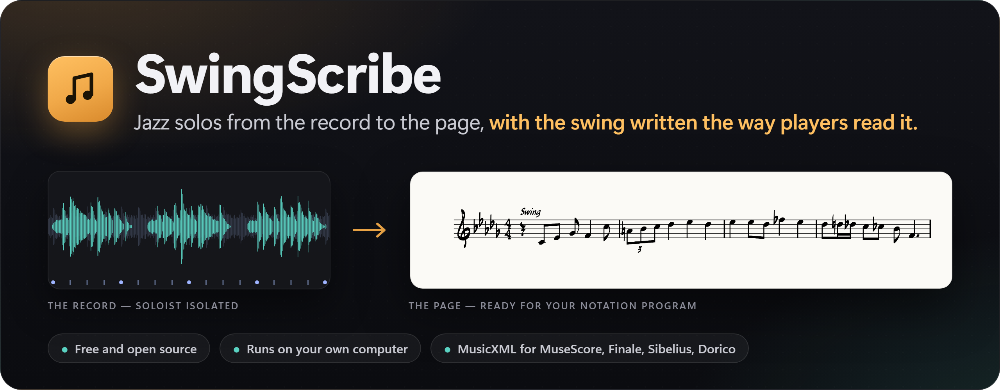
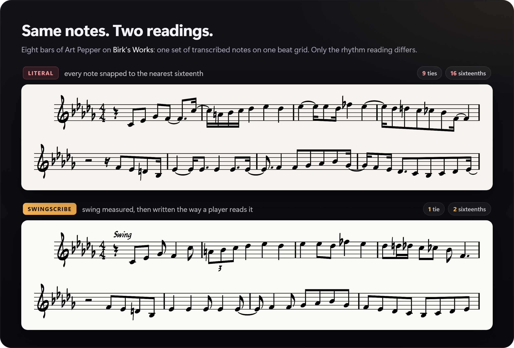
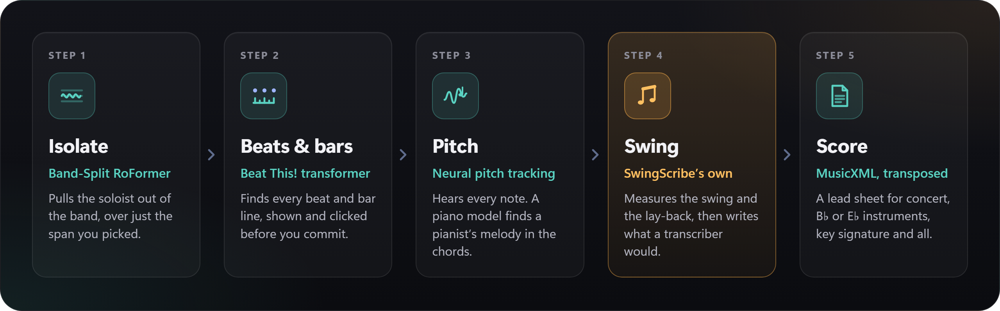
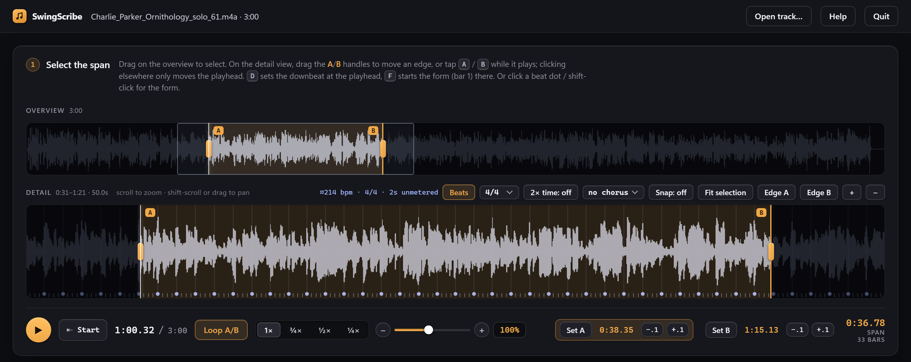
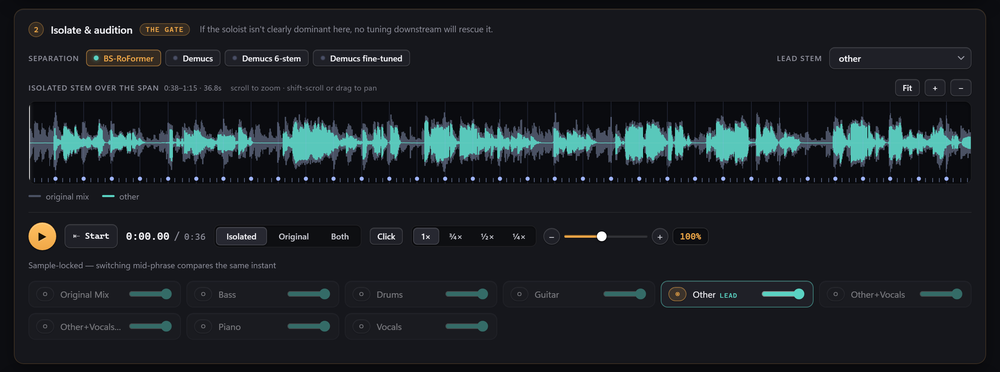
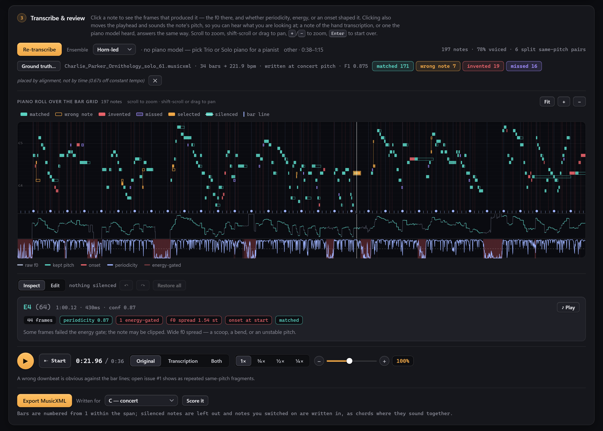

<p align="center">
  
</p>

<p align="center">
  <a href="https://github.com/elkayem/swingscribe/releases/latest"></a>
  <a href="INSTALL.md"></a>
  <a href="src/swingscribe/gui/guide/user-guide.md"></a>
</p>

<p align="center">
  
  
  
</p>

**SwingScribe turns a jazz record into a solo transcription you would
actually play from.** Mark the solo, and SwingScribe pulls the soloist out of
the band, finds every beat and bar, and hears every note. Then it writes a
clean lead sheet, with swung eighths written as eighths under a *Swing*
marking, the way jazz musicians read them. It runs on your own computer, and
it is free.

## Why SwingScribe

<p align="center">
  
</p>

Most automatic transcription writes down exactly what it measures, and in
jazz that is the wrong answer. Swung eighths come out as triplets or dotted
rhythms, a laid-back soloist lands a sixteenth late, and the page fills with
ties. SwingScribe measures the swing and the lay-back first, then writes
what a transcriber would.

<table>
<tr>
<td width="50%" valign="top">

### Writes swing, not arithmetic
It measures how hard each passage swings and how far the soloist sits
behind the beat. Then it writes eighths as eighths and keeps the triplets
that were really played, guided by statistics from **245 human jazz
transcriptions**.

</td>
<td width="50%" valign="top">

### Hears the soloist, not the band
A state-of-the-art AI model lifts the horn or piano out of the full mix,
over just the passage you picked. You can compare it with the original
before a note is written.

</td>
</tr>
<tr>
<td valign="top">

### Shows you the bars first
The bar grid is drawn over the waveform before you transcribe, with a click
track to check it by ear. If the downbeat is wrong, one keypress moves it.

</td>
<td valign="top">

### Handles pianists too
A dedicated piano model hears every key a pianist strikes, and SwingScribe
picks the melody out of the chords. Switch on any other note it heard to
write a chord.

</td>
</tr>
<tr>
<td valign="top">

### Keeps you in charge
Every note sits on a piano roll with the evidence behind it. Silence
whatever belongs to another instrument. Your edits survive a
re-transcription.

</td>
<td valign="top">

### Private, free and open
There are no accounts, uploads or subscriptions. It exports MusicXML for
MuseScore, Finale, Sibelius or Dorico, transposed for B♭ and E♭ horns.

</td>
</tr>
</table>

## How it works

<p align="center">
  
</p>

SwingScribe uses four research-grade neural networks and one engine of its
own.

- **[Band-Split RoFormer](https://arxiv.org/abs/2309.02612)** isolates the
  soloist. This transformer took first place in the music separation track
  of the 2023 Sound Demixing Challenge. It keeps a saxophone in one piece
  where older separators tear it between stems.
  [Demucs](https://arxiv.org/abs/2211.08553) is one click away when speed
  matters more.
- **[Beat This!](https://arxiv.org/abs/2407.21658)** tracks the beat. It is a
  transformer beat tracker from JKU Linz (ISMIR 2024). SwingScribe repairs
  its dropped and doubled beats into a bar grid you can steer.
- **Neural pitch tracking** hears the notes. A deep convolutional network,
  [CREPE](https://arxiv.org/abs/1802.06182), reads the soloist's pitch a
  hundred times a second. SwingScribe keeps the soloist and rejects what
  leaked in from the band.
- **[High-resolution piano transcription](https://arxiv.org/abs/2010.01815)**
  hears every note of a piano solo, and SwingScribe picks the melody out of
  the comping.
- **SwingScribe's rhythm engine** writes the page. This is the part you will
  not find anywhere else. It measures the swing section by section and
  removes the soloist's lag behind the band. Then it reads each beat at the
  simplest rhythm the notes support.

## See it in action

**Find the solo.** Mark it on the overview and place its edges on the
detail view. Check the bar grid by eye and by ear, and slow the music down
without changing its pitch.



**Hear the soloist alone.** Switch between the isolated instrument and the
original mid-phrase. Playback is sample-locked, and every stem has its own
fader.



**Review every note.** Click any note to hear it and see why it was
written. Load a hand transcription and every note is marked as matched,
wrong, missed or invented.



## Measured against human transcribers

| Question | Reference | Result |
|---|---|---|
| Did it hear the notes that were played? | 73 solos from the [Weimar Jazz Database](https://jazzomat.hfm-weimar.de/dbformat/dboverview.html), every note annotated by hand | note F1 **0.86** |
| Are the beats in the right place? | the same 73 solos | beat F1 **0.94** |
| Is the rhythm written the way a transcriber wrote it? | 12 transcriptions made by ear | **85%** of matched notes agree |
| And the way the Omnibook wrote it? | 22 solos from the *Charlie Parker Omnibook* | **78%** of matched notes agree |

F1 is the standard transcription score. At 1.0, every note is found and
nothing is invented. The project keeps an open
[list of what is still wrong](docs/benchmark-deficiencies.md).

## Get started

**Windows:** download `SwingScribe-<version>-windows-x64.zip` (about 450 MB)
from the [latest release](https://github.com/elkayem/swingscribe/releases/latest).
It holds everything the app needs, including its own Python. Extract it,
double-click `setup.cmd` once, and then use the SwingScribe icon.

**From source** on Windows or Linux, with [uv](https://docs.astral.sh/uv/):

```bash
git clone https://github.com/elkayem/swingscribe.git
cd swingscribe
uv sync --group ml --group gui --group roformer
uv run python -m swingscribe gui
```

The app opens in your browser, and you do not need a GPU. See the
**[installation guide](INSTALL.md)** for both routes in detail, and the
**[user guide](src/swingscribe/gui/guide/user-guide.md)** for every control.
The user guide is also behind the app's **Help** button.

## Also in the box

- **A command line** for every step, so you can script a batch of solos.
  See the [user guide](src/swingscribe/gui/guide/user-guide.md#the-command-line).
- **pdf2musicxml** turns PDF transcriptions, from single solos to whole
  books, into MusicXML. It lists the bars that need proofreading.
  See [docs/pdf2musicxml.md](docs/pdf2musicxml.md).
- **For developers,** [docs/development.md](docs/development.md) covers the
  tests and the benchmarks.

## Licence

SwingScribe is MIT licensed. The AI models download on first use under their
own licences, listed in [NOTICES.md](packaging/NOTICES.md). The default
separator's weights (BS-Roformer-SW) were published by the community with no
stated licence or author, and SwingScribe does not ship them. For commercial
work, choose Demucs (MIT) in the separator menu.
